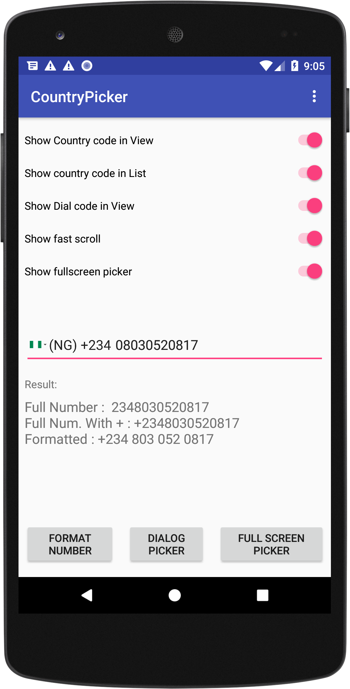
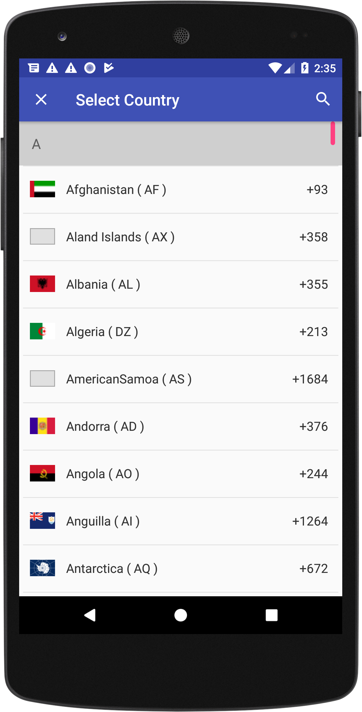
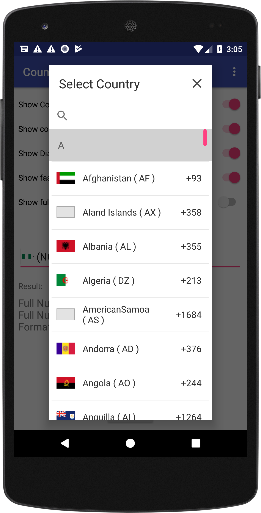

# CountryPicker 
CountryPicker is a library that consist of a PhoneNumberEditText and a standalone Picker for countries. PhoneNumberEditText offers and EditText for smooth selection of any Countries dial code and other intesting features.


[](https://travis-ci.org/po10cio/Android-Kotlin-Boilerplate)
[](https://jitpack.io/#po10cio/TimeLineView)
[]( https://android-arsenal.com/details/1/6540 )
[](https://github.com/po10cio/TimeLineView/blob/master/LICENSE.md) 


## Showcase

&nbsp;&nbsp;&nbsp;&nbsp;&nbsp;
&nbsp;&nbsp;&nbsp;&nbsp;&nbsp;
&nbsp;&nbsp;&nbsp;&nbsp;&nbsp;
&nbsp;&nbsp;&nbsp;&nbsp;&nbsp;


## Quick Setup
### 1. Include library

**Using Gradle**

TimelineView is currently available in on Jitpack so add the following line before every other thing if you have not done that already.

```gradle
allprojects {
  repositories {
    ...
    maven { url 'https://jitpack.io' }
  }
}
```
	
Then add the following line 

``` gradle
dependencies {
  compile 'com.github.po10cio:CountryPicker:1.0.0'
}
```

**Using Maven**

Also add the following lines before adding the maven dependency

```maven
<repositories>
  <repository>
    <id>jitpack.io</id>
    <url>https://jitpack.io</url>
  </repository>
</repositories>
```
Then add the dependency

``` maven
<dependency>
  <groupId>com.github.po10cio</groupId>
  <artifactId>CountryPicker</artifactId>
  <version>1.0.0</version>
</dependency>
```

### 2. Usage
In your XML layout include the TimelineView as follows:

```xml
<me.jerryhanks.countrypicker.PhoneNumberEditText
        android:id="@+id/countryPicker"
        android:layout_width="match_parent"
        android:layout_height="wrap_content"
        android:layout_marginEnd="8dp"
        android:layout_marginStart="8dp"
        android:layout_marginTop="58dp"
        android:hint="08030720816"
        app:cp_autoDetectCountry="false"
        app:cp_fastScrollerBubbleColor="@color/colorPrimary"
        app:cp_fastScrollerBubbleTextAppearance="@style/TextAppearance.AppCompat.Medium"
        app:cp_fastScrollerHandleColor="@color/colorAccent"
        app:cp_preferredCountries="ng,dz,au,az"
        app:cp_rememberLastSelection="true"
        app:cp_setCountryCodeBorder="true"
        app:cp_showCountryCodeInView="true"
        app:cp_showCountryDialCodeInView="true"
        app:cp_showFastScroll="true"
        app:cp_showFullScreeDialog="true" />
      
```
## XML Attributes

List of xml attribues that are available in PhoneNumberEdittext

| XML Attribute | Description   | Default |
| ------------- |---------------|---------| 
| cp_autoDetectCountry      | Enables auto detection of the country the device is currently being used | true|
|cp_searchAllowed||
|cp_showFastScroll||
|cp_dialogKeyboardAutoPopup||
|cp_showFullScreeDialog||
|cp_showCountryCodeInView||
|cp_showCountryCodeInList||
|cp_showCountryDialCodeInView||
|cp_showCountryDialCodeInList||
|cp_setCountryCodeBorder||
|cp_defaultCountryName||
|cp_preferredCountries||
|cp_fastScrollerBubbleColor| Sets the color of the fast scroller bubble color| #5e64ce
|cp_fastScrollerBubbleTextAppearance|Sets the testAppearance of the fastScroller| TextAppearance.AppCompat.Medium|
|cp_fastScrollerHandleColor|Sets the fastscroller handle color| #8f93d1


## Changelog

See the [changelog](/CHANGELOG.md) file.


## License

CountryPicker is distributed under the MIT license. [See LICENSE](https://github.com/po10cio/TimeLineView/blob/master/LICENSE.md) for details.
